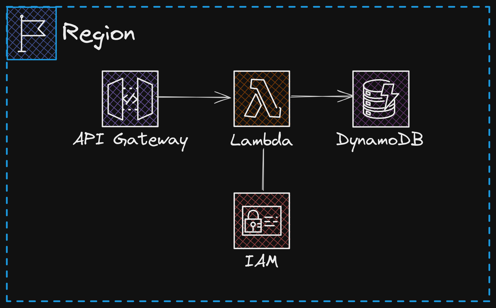

# Power of Math

This project contains source code and supporting files for a serverless application that calculates the power of a number and stores the result in a DynamoDB table. The application is built using the AWS Serverless Application Model (SAM) and includes the following components:

-   **API Gateway**: Exposes an HTTP endpoint to trigger the Lambda function.
-   **Lambda Function**: Handles the logic to calculate the power of a number and save the result in DynamoDB.
-   **DynamoDB Table**: Stores the results of the calculations.

This is my first project working on AWS, I followed this [tutorial](https://www.youtube.com/watch?v=7m_q1ldzw0U&list=PLwyXYwu8kL0wMalR9iXJIPfiMYWNFWQzx&index=3&ab_channel=TinyTechnicalTutorials) to practice developing some apps using the AWS Cloud. In this video I learned how to create this app via UI but I decided to create this same application but using the SAM Templates.

## How It Works

1. **API Gateway Endpoint**:

    - A POST request is sent to the API Gateway endpoint with a JSON payload containing the `base` and `exponent` values.
    - Example payload:
        ```json
        {
            "base": 5,
            "exponent": 3
        }
        ```

2. **Lambda Function**:

    - The Lambda function receives the request, calculates the result of `base^exponent`, and generates a unique ID for the operation.
    - The result is saved in a DynamoDB table along with the unique ID.

3. **DynamoDB Table**:

    - The table stores the calculation results in the following format:
        - `id`: A unique identifier for the calculation (UUID).
        - `result`: The result of the calculation.

4. **Response**:
    - The Lambda function returns a response to the client with the calculated result.

## Architecture Diagram

Below is a high-level architecture diagram of the application:



## Project Structure

-   **`power-of-math`**: Contains the Lambda function code.
-   **`events`**: Contains sample invocation events for testing the Lambda function locally.
-   **`power-of-math/lib`**: Contains utility files for CORS handling and configuration.
-   **`power-of-math/tests`**: Contains unit tests for the application code.
-   **`template.yaml`**: Defines the AWS resources for the application, including the API Gateway, Lambda function, and DynamoDB table.

## Deploy the Application

To deploy the application, you need the following tools:

-   **SAM CLI**: [Install the SAM CLI](https://docs.aws.amazon.com/serverless-application-model/latest/developerguide/serverless-sam-cli-install.html)
-   **Node.js**: [Install Node.js 22](https://nodejs.org/en/), including the NPM package management tool.

### Steps to Deploy

1. Build the application:

    ```bash
    sam build
    ```

2. Deploy the application:

    ```bash
    sam deploy --guided
    ```

    During deployment, you will be prompted to provide the following:

    - **Stack Name**: A unique name for your CloudFormation stack.
    - **AWS Region**: The AWS region where you want to deploy the application.
    - **IAM Role Permissions**: Allow SAM CLI to create necessary IAM roles.

3. After deployment, note the API Gateway endpoint URL from the output.

## Test the Application Locally

You can test the Lambda function locally using the SAM CLI.

> [!NOTE] You must be located in the root path

1. Build the application:

    ```bash
    sam build
    ```

2. Invoke the function locally with a test event:

    ```bash
    sam local invoke PowerOfMathFunction -e ./events/event.json
    ```

3. Start the API locally:

    ```bash
    sam local start-api
    ```

    Test the API using `curl`:

    ```bash
    curl -X POST http://localhost:3000/ -d '{"base": 5, "exponent": 3}' -H "Content-Type: application/json"
    ```

## Cleanup

To delete the application and its resources, run:

```bash
sam delete --stack-name power-of-math
```

## Unit Tests

Unit tests are located in the `power-of-math/tests` folder. To run the tests:

>[!NOTE] You must be located in the following path: `power-of-math/power-of-math`

1. Install dependencies:

    ```bash
    npm install
    ```

2. Run the tests:
    ```bash
    npm test
    ```

## Resources

-   [AWS SAM Developer Guide](https://docs.aws.amazon.com/serverless-application-model/latest/developerguide/what-is-sam.html)
-   [AWS Lambda Documentation](https://docs.aws.amazon.com/lambda/latest/dg/welcome.html)
-   [Amazon DynamoDB Documentation](https://docs.aws.amazon.com/amazondynamodb/latest/developerguide/Introduction.html)
-   [YouTube Tutorial](https://www.youtube.com/watch?v=7m_q1ldzw0U&list=PLwyXYwu8kL0wMalR9iXJIPfiMYWNFWQzx&index=3&ab_channel=TinyTechnicalTutorials)
