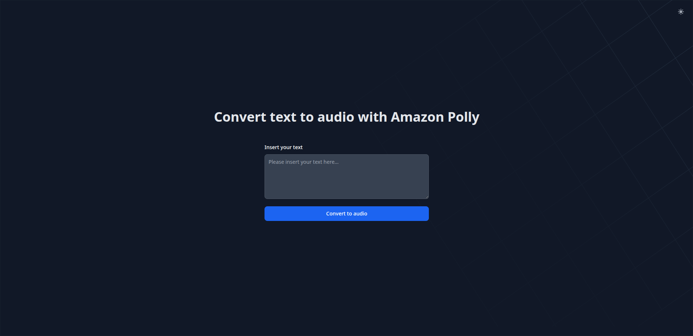
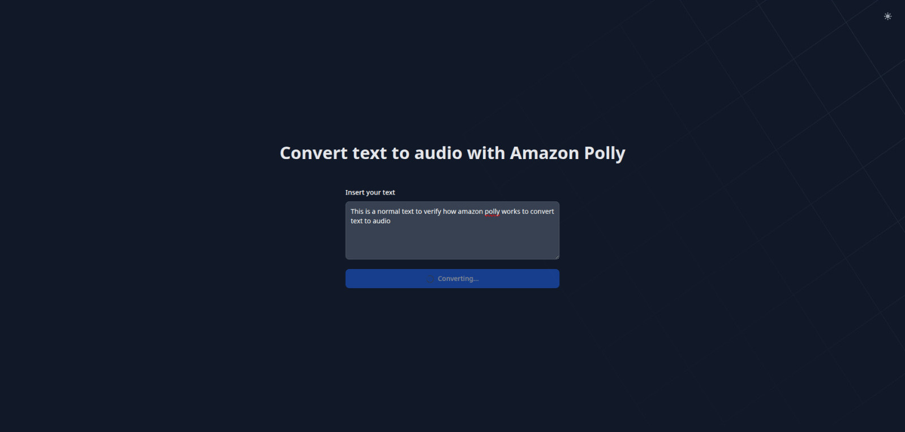
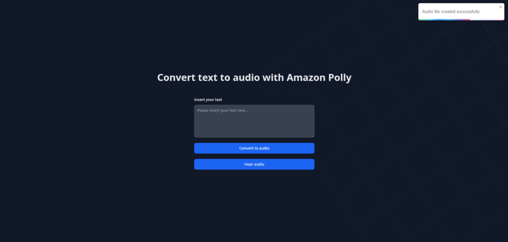

# Text to Audio UI

This project is a simple React + TypeScript + Vite application that serves as the frontend for the ["Text to Audio"](../text-to-audio/README.md) project. It allows users to input text, convert it to audio using the backend API, and preview the generated audio file.

The UI is styled using the Flowbite library, which leverages Tailwind CSS v4 for rapid design.

## How It Works

1. **Insert Text**:

   - Users can input the text they want to convert into audio in the provided text field.
   - 

2. **Convert to Audio**:

   - When the "Convert to audio" button is clicked, the button text changes to "Loading" with a spinner while the request is being processed.
   - 

3. **Show Alert**:

   - Once the request is completed, an alert is displayed with the status of the operation (success or error).
   - 

4. **Preview Audio**:
   - If the request is successful, a new button appears that redirects the user to the preview of the generated audio file.
   - 

## Setup and Installation

To run the project locally, follow these steps:

1. Clone the repository:

   ```bash
   https://github.com/TheRialNiels/AWS-Projects.git
   cd text-to-audio-ui
   ```

2. Install dependencies:

   ```bash
   npm install
   ```

3. Start the development server:

   ```bash
   npm run dev
   ```

4. Open your browser and navigate to `http://localhost:5173`.

## Features

- **React + TypeScript**: Built with modern React and TypeScript for type safety.
- **Flowbite + Tailwind CSS**: Rapid UI design using Flowbite components and Tailwind CSS.
- **API Integration**: Connects to the backend API to convert text to audio.
- **User Feedback**: Provides real-time feedback with loading spinners and alerts.
- **Audio Preview**: Allows users to preview the generated audio file.

## Future Improvements

This project is a simple design with room for improvement. Planned enhancements include:

- Adding more customization options for the audio (e.g., voice selection, etc...).
- Adding error handling for edge cases.
- Implementing unit and integration tests.

## Resources

- [React Documentation](https://reactjs.org/docs/getting-started.html)
- [TypeScript Documentation](https://www.typescriptlang.org/docs/)
- [Vite Documentation](https://vitejs.dev/guide/)
- [Flowbite React Documentation](https://flowbite-react.com/docs/getting-started/introduction)
- [Tailwind CSS Documentation](https://tailwindcss.com/docs/installation)
