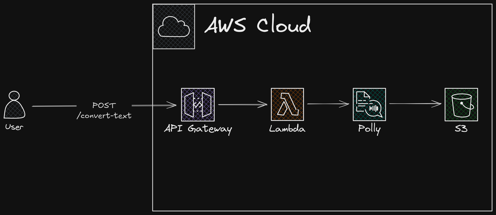

# Text to Audio

This project contains source code and supporting files for a serverless application that converts text into audio using Amazon Polly and stores the audio files in an S3 bucket. The application is built using the AWS Serverless Application Model (SAM) and includes the following components:

-   **API Gateway**: Exposes an HTTP endpoint to trigger the Lambda function.
-   **Lambda Function**: Handles the logic to convert text to audio using Amazon Polly, save the audio file in S3, and generate a signed URL for accessing the file.
-   **Amazon S3**: Stores the generated audio files in a protected bucket.

This project was inspired by this [tutorial](https://www.youtube.com/watch?v=hiE0El3zs1Y&list=PLYJ6Nch8PrM8HSO7xds8TNXLJa8oo6vqy&index=6&ab_channel=TechWithLucy), which demonstrated how to create a similar application using Lambda, Polly, and S3. I extended the idea by adding an API Gateway to connect everything, allowing me to practice creating projects with React. The UI for this project can be found in this same repository by clicking [here](../text-to-audio-ui/README.md). More details about the UI are available in that link.

## How It Works

1. **API Gateway Endpoint**:

    - A POST request is sent to the API Gateway endpoint with a JSON payload containing the `text` value.
    - Example payload:
        ```json
        {
            "text": "Send any text that you want to convert to audio"
        }
        ```

2. **Lambda Function**:

    - The Lambda function receives the request, uses Amazon Polly to synthesize the text into audio, and saves the audio file in an S3 bucket with a unique name.
    - The S3 bucket is protected and not publicly accessible. To allow users to access the audio file, the Lambda function generates a signed URL, which is valid for a limited time.

3. **Amazon S3**:

    - The S3 bucket stores the audio files securely. Access to the files is only possible via the signed URL generated by the Lambda function.

4. **Response**:
    - The Lambda function returns a response to the client with the signed URL of the generated audio file.

## Architecture Diagram

Below is a high-level architecture diagram of the application:



## Project Structure

-   **`template.yaml`**: Defines the AWS resources for the application, including the API Gateway, Lambda function, and S3 bucket.
-   **`events`**: Contains sample invocation events for testing the Lambda function locally.
-   **`text-to-audio/src/convertText.ts`**: Contains the Lambda function code.
-   **`text-to-audio/src/corsUtils.ts`**: Contains utility files for handling the CORS headers.

## Deploy the Application

To deploy the application, you need the following tools:

-   **SAM CLI**: [Install the SAM CLI](https://docs.aws.amazon.com/serverless-application-model/latest/developerguide/serverless-sam-cli-install.html)
-   **Node.js**: [Install Node.js 22](https://nodejs.org/en/), including the NPM package management tool.

### Steps to Deploy

1. Build the application:

    ```bash
    sam build
    ```

2. Deploy the application:

    ```bash
    sam deploy --guided
    ```

    During deployment, you will be prompted to provide the following:

    - **Stack Name**: A unique name for your CloudFormation stack.
    - **AWS Region**: The AWS region where you want to deploy the application.
    - **IAM Role Permissions**: Allow SAM CLI to create necessary IAM roles.

3. After deployment, note the API Gateway endpoint URL from the output.

## Test the Application Locally

You can test the Lambda function locally using the SAM CLI.

> [!NOTE] You must be located in the root path

1. Build the application:

    ```bash
    sam build
    ```

2. Invoke the function locally with a test event:

    ```bash
    sam local invoke ConvertTextFunction -e ./events/event.json --env-vars ./events/env.json
    ```

3. Start the API locally:

    ```bash
    sam local start-api --env-vars ./events/env.json
    ```

    Test the API using `curl`:

    ```bash
    curl -X POST http://localhost:3000/ -d '{"text": "Quick test running the API locally"}' -H "Content-Type: application/json"
    ```

## Cleanup

To delete the application and its resources, run:

```bash
sam delete --stack-name text-to-audio
```

## Resources

-   [AWS SAM Developer Guide](https://docs.aws.amazon.com/serverless-application-model/latest/developerguide/what-is-sam.html)
-   [AWS Lambda Documentation](https://docs.aws.amazon.com/lambda/latest/dg/welcome.html)
-   [Amazon Polly Documentation](https://docs.aws.amazon.com/polly/latest/dg/what-is.html)
-   [Amazon S3 Documentation](https://docs.aws.amazon.com/s3/index.html)
-   [YouTube Tutorial](https://www.youtube.com/watch?v=hiE0El3zs1Y&list=PLYJ6Nch8PrM8HSO7xds8TNXLJa8oo6vqy&index=6&ab_channel=TechWithLucy)
